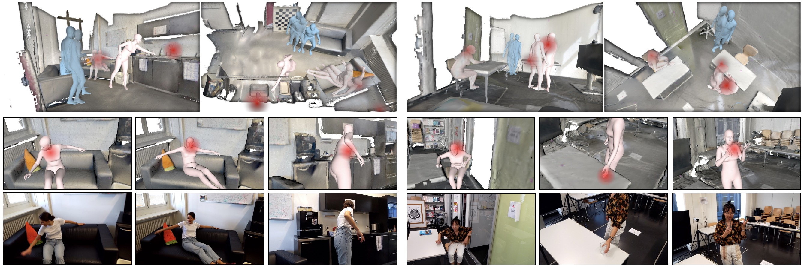
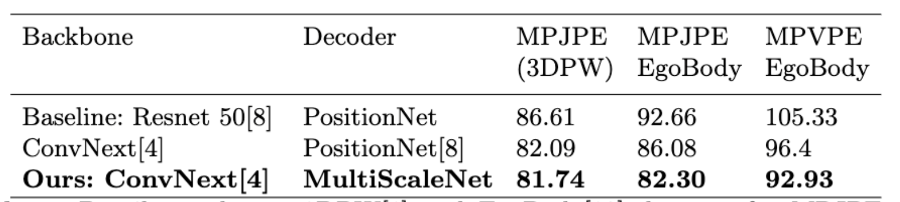

<div align="center">
    
# MEEV: Body Mesh Estimation on Egocentric Video

<!-- [](https://arxiv.org/abs/1234) -->
[](https://eccv2022.ecva.net/)
[](https://sanweiliti.github.io/egobody/egobody.html)
[](https://opensource.org/licenses/MIT)
<!-- 
Official Implementation of MEEV | [Paper](https://arxiv.org/abs/1234) | [Slide]() | [Poster]() -->

</div>

# Introduction




This repository hold the code used for the [EgoBody Challenge](https://sanweiliti.github.io/egobody/egobody.html) in ECCV 2022 "Human body, hands, and activities from egocentric and multi-view cameras" workshop.
This is the first place results of the [Challenge](https://codalab.lisn.upsaclay.fr/competitions/6351#results).

The code is based on the [Hand4Whole_RELEASE](https://github.com/mks0601/Hand4Whole_RELEASE/tree/Pose2Pose) repository ( the Pose2Pose branch ).

## Directory  
### Root  
The `${ROOT}` is described as below.  
```  
${ROOT}  
|-- data  
|-- demo
|-- main  
|-- tool
|-- output  
|-- common
|   |-- utils
|   |   |-- human_model_files
|   |   |   |-- smpl
|   |   |   |   |-- SMPL_NEUTRAL.pkl
|   |   |   |-- smplx
|   |   |   |   |-- MANO_SMPLX_vertex_ids.pkl
|   |   |   |   |-- SMPL-X__FLAME_vertex_ids.npy
|   |   |   |   |-- SMPLX_NEUTRAL.pkl
|   |   |   |   |-- SMPLX_to_J14.pkl
|   |   |   |-- mano
|   |   |   |   |-- MANO_LEFT.pkl
|   |   |   |   |-- MANO_RIGHT.pkl
|   |   |   |-- flame
|   |   |   |   |-- flame_dynamic_embedding.npy
|   |   |   |   |-- flame_static_embedding.pkl
|   |   |   |   |-- FLAME_NEUTRAL.pkl
```  
* `data` contains data loading codes and soft links to images and annotations directories.  
* `demo` contains demo codes.
* `main` contains high-level codes for training or testing the network.  
* `tool` contains pre-processing codes of AGORA and pytorch model editing codes.
* `output` contains log, trained models, visualized outputs, and test result.  
* `common` contains kernel codes for Hand4Whole.  
* `human_model_files` contains `smpl`, `smplx`, `mano`, and `flame` 3D model files. Download the files from [[smpl]](https://smpl.is.tue.mpg.de/) [[smplx]](https://smpl-x.is.tue.mpg.de/) [[SMPLX_to_J14.pkl]](https://github.com/vchoutas/expose#preparing-the-data) [[mano]](https://mano.is.tue.mpg.de/) [[flame]](https://flame.is.tue.mpg.de/).

## SMPL(X) Installation

To install the SMPL model please follow the next steps in the specified order on the common/utils folder:
1. To install from PyPi simply run: 
  ```Shell
  pip install smplx[all]
  ```
2. Clone this repository and install it using the *setup.py* script: 
```Shell
git clone https://github.com/vchoutas/smplx
python setup.py install
```
You should have a smplx folder that allow to use SMPL model files.


### Data  
You need to follow directory structure of the `data` as below.  
```  
${ROOT}  
|-- data  
|   |-- AGORA
|   |   |-- data
|   |   |   |-- AGORA_train.json
|   |   |   |-- AGORA_validation.json
|   |   |   |-- AGORA_test_bbox.json
|   |   |   |-- 1280x720
|   |   |   |-- 3840x2160
|   |-- Human36M  
|   |   |-- images  
|   |   |-- annotations  
|   |-- MPII
|   |   |-- data
|   |   |   |-- images
|   |   |   |-- annotations
|   |-- MPI_INF_3DHP
|   |   |-- data
|   |   |   |-- images_1k
|   |   |   |-- MPI-INF-3DHP_1k.json
|   |   |   |-- MPI-INF-3DHP_camera_1k.json
|   |   |   |-- MPI-INF-3DHP_joint_3d.json
|   |   |   |-- MPI-INF-3DHP_SMPL_NeuralAnnot.json
|   |-- MSCOCO  
|   |   |-- images  
|   |   |   |-- train2017  
|   |   |   |-- val2017  
|   |   |-- annotations 
|   |-- PW3D
|   |   |-- data
|   |   |   |-- 3DPW_train.json
|   |   |   |-- 3DPW_validation.json
|   |   |   |-- 3DPW_test.json
|   |   |-- imageFiles

```

* Download AGORA parsed data [[data](https://drive.google.com/drive/folders/18CWsL28e8v50rqEbYMoU4yHHWoGJdpg_?usp=sharing)][[parsing codes](tool/AGORA)]
* Download Human3.6M parsed data and SMPL-X parameters [[data](https://drive.google.com/drive/folders/1r0B9I3XxIIW_jsXjYinDpL6NFcxTZart?usp=sharing)][[SMPL-X parameters from NeuralAnnot](https://drive.google.com/drive/folders/19ifIQtAB3ll8d37-kerL1eQWp31mOwJM?usp=sharing)]
* Download MPII parsed data and SMPL-X parameters [[data](https://drive.google.com/drive/folders/1rrL_RxhwQgwhq5BU1iIRPwl285B_KTpU?usp=sharing)][[SMPL-X parameters from NeuralAnnot](https://drive.google.com/file/d/1alkKvhkqQGqriKst83uS-kUG7v6SkM7W/view?usp=sharing)]
* Download MPI-INF-3DHP parsed data and SMPL-X parameters [[data](https://drive.google.com/drive/folders/1wQbHEXPv-WH1sNOLwdfMVB7OWsiJkq2M?usp=sharing)][[SMPL-X parameters from NeuralAnnot](https://drive.google.com/file/d/1ADOJlaqaBDjZ3IEgrgLTQwNf6iHd-rGH/view?usp=sharing)]
* Download MSCOCO data and SMPL-X parameters [[data](https://github.com/jin-s13/COCO-WholeBody)][[SMPL-X parameters from NeuralAnnot](https://drive.google.com/file/d/1RVJiI2Y1TjiAPcRnDZk5CX5L7Vehfinm/view?usp=sharing)]
* Download 3DPW parsed data [[data](https://drive.google.com/drive/folders/1HByTBsdg_A_o-d89qd55glTl44ya3dOs?usp=sharing)]
* All annotation files follow [MSCOCO format](http://cocodataset.org/#format-data). If you want to add your own dataset, you have to convert it to [MSCOCO format](http://cocodataset.org/#format-data).  
  
  
### Output  
You need to follow the directory structure of the `output` folder as below.  
```  
${ROOT}  
|-- output  
|   |-- log  
|   |-- model_dump  
|   |-- result  
|   |-- vis  
```  
* Creating `output` folder as soft link form is recommended instead of folder form because it would take large storage capacity.  
* `log` folder contains training log file.  
* `model_dump` folder contains saved checkpoints for each epoch.  
* `result` folder contains final estimation files generated in the testing stage.  
* `vis` folder contains visualized results.  


### Dependencies
To run the training ( or some tools ) you need to install some dependencies, an environment.yml is available to create a conda environment.


### Training
#### PreTrain
`python train.py --gpu 0 --parts body --output [output_folder] --config experiments/pre_train.yaml`

#### FineTune
`python train.py --gpu 0 --parts body --config experiments/fine_tuning.yaml --continue --output_dir [output_folder]`


### Testing on all test datasets
`python test.py --gpu 0 --parts body -test_epoch 6 --output [output_folder] --config experiments/fine_tuning.yaml`

### Generate JSON for challenge evaluation
`python generate_ego_body_json.py --gpu 0 --parts body -test_epoch 6 --output [output_folder] --config experiments/fine_tuning.yaml`

### Tools

To visualize a dataset: 
go to the tool folder and run the `visualize.py` script.


### Datasets

- Version 1: Human36M, MSCOCO, MPII, MPI_INF_3DHP
- Version 2: Human36M, MSCOCO, MPII, MPI_INF_3DHP, AGORA

### Results




## Related Projects
[Hand4Whole_RELEASE](https://github.com/mks0601/Hand4Whole_RELEASE)  
[NeuralAnnot_RELEASE](https://github.com/mks0601/NeuralAnnot_RELEASE)


## Troubleshoots
* `RuntimeError: Subtraction, the '-' operator, with a bool tensor is not supported. If you are trying to invert a mask, use the '~' or 'logical_not()' operator instead.`: Go to [here](https://github.com/mks0601/I2L-MeshNet_RELEASE/issues/6#issuecomment-675152527)


## License
```
MIT License

Copyright (c) 2022-present NAVER Corp.

Permission is hereby granted, free of charge, to any person obtaining a copy
of this software and associated documentation files (the "Software"), to deal
in the Software without restriction, including without limitation the rights
to use, copy, modify, merge, publish, distribute, sublicense, and/or sell
copies of the Software, and to permit persons to whom the Software is
furnished to do so, subject to the following conditions:

The above copyright notice and this permission notice shall be included in
all copies or substantial portions of the Software.

THE SOFTWARE IS PROVIDED "AS IS", WITHOUT WARRANTY OF ANY KIND, EXPRESS OR
IMPLIED, INCLUDING BUT NOT LIMITED TO THE WARRANTIES OF MERCHANTABILITY,
FITNESS FOR A PARTICULAR PURPOSE AND NONINFRINGEMENT.  IN NO EVENT SHALL THE
AUTHORS OR COPYRIGHT HOLDERS BE LIABLE FOR ANY CLAIM, DAMAGES OR OTHER
LIABILITY, WHETHER IN AN ACTION OF CONTRACT, TORT OR OTHERWISE, ARISING FROM,
OUT OF OR IN CONNECTION WITH THE SOFTWARE OR THE USE OR OTHER DEALINGS IN
THE SOFTWARE.
```
